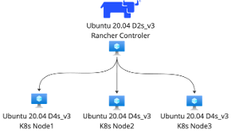

# Trailblazers K8s Space

The objective here is to gain a level of comfort in the cloud native application space.

## Basic Cloud Native Application for Lab

## 1) The Rancher Node

### install k3s
K3s is a lightweight K8s installation we will use to house Rancher.
~~~
K3S_VERSION="v1.33.5+k3s1"

curl -sfL https://get.k3s.io | \
        INSTALL_K3S_VERSION=${K3S_VERSION} \
        INSTALL_K3S_EXEC='server --cluster-init --write-kubeconfig-mode=644' \
        sh -s -
~~~
### install helm
We use Helm to install Rancher and Cilium.
~~~
curl -fsSL -o get_helm.sh https://raw.githubusercontent.com/helm/helm/main/scripts/get-helm-3
chmod 700 get_helm.sh
./get_helm.sh
~~~
### set k8s configs
~~~
mkdir .kube
cp /etc/rancher/k3s/k3s.yaml .kube/config
~~~
### Cert Manager

Check the current version for compatibility. Replace `<VERSION>` with the desired cert-manager release version (e.g., `v1.17.4`).

~~~
kubectl apply -f https://github.com/cert-manager/cert-manager/releases/download/<VERSION>/cert-manager.crds.yaml

helm repo add jetstack https://charts.jetstack.io

helm repo update

helm install cert-manager jetstack/cert-manager \
  --namespace cert-manager \
  --create-namespace \
  --version v1.17.4 \
  --set crds.enabled=true

~~~
### check the cert manager is running
~~~
kubectl get po -n cert-manager
~~~
### Rancher Install

Replace `<instanceip>` with your node's public IP address.

~~~
helm repo add rancher-latest https://releases.rancher.com/server-charts/latest

helm repo update

kubectl create namespace cattle-system

helm install rancher rancher-latest/rancher \
  --namespace cattle-system \
  --set hostname=<instanceip>.sslip.io \
  --set replicas=1 \
  --set bootstrapPassword=Rancher
~~~
*Remember: hostname is the public IP and must be permanent.*
### check the rancher is running
~~~
watch -n 2 kubectl get po -n cattle-system
~~~

## 2) Node setup Ubuntu (performed on each node in the cluster)

*Disable UFW*
~~~
sudo ufw status
sudo ufw disable
sudo reboot
~~~

#### Define a K8s Cluster
*Use Rancher UI to define and deploy a K8s cluster*

## Additional Guides

- [Configure Cilium in AWS](./docs/configure-cilium-in-aws.md)
- [Cilium Gateway API Setup - Recap](./docs/cilium-gateway-recap.md)
- [Cilium Gateway API Overrides](./docs/cilium-overrides.yaml)
- [Save Current State Script](./docs/save-current-state.sh)
